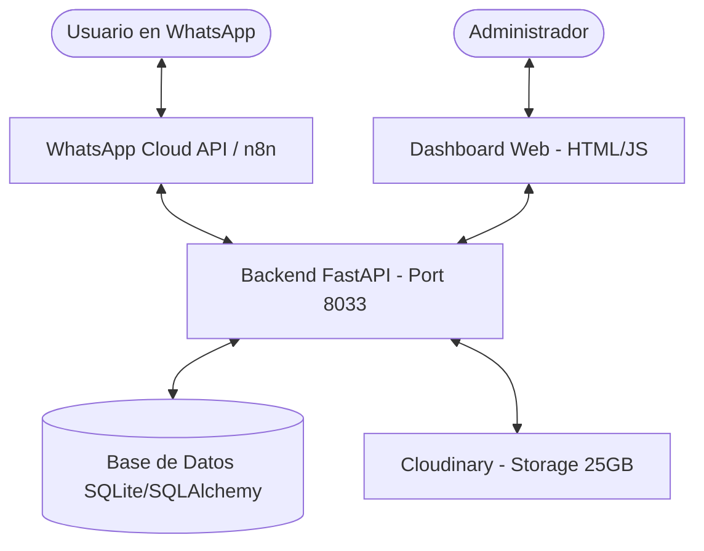

# Especificaciones Técnicas - Sistema Automatizado de Sorteos

## 📝 Descripción General
Sistema integral diseñado para la automatización de sorteos a través de WhatsApp. La plataforma permite el registro de usuarios mediante cédula, la recepción y validación inteligente de tickets de juego (Betplay, Chance), y la gestión administrativa de los datos recolectados a través de un dashboard en tiempo real.

## 🏗️ Diagrama de Arquitectura

## 🌐 Detalles de Despliegue
*   **Servidor IP:** `192.168.2.91`
*   **Puerto de API:** `8033`
*   **Protocolo:** HTTP/REST

## 🛠️ Stack Tecnológico
*   **Backend:** Python 3.9+ con FastAPI
*   **Base de Datos:** Postgresql (SQLAlchemy ORM)
*   **Frontend Administrador:** Vanilla HTML5, CSS3 y JavaScript
*   **Integración WhatsApp:** n8n / Webhooks
*   **Almacenamiento de Multimedia:** Cloudinary (25 GB disponibles)

## 🧠 Extracción Inteligente de Información
El sistema utiliza técnicas de OCR y procesamiento inteligente para identificar y extraer datos de los tickets enviados por los usuarios:
*   **Tipo de Ticket:** Identificación automática (Betplay, Chance, Loterías).
*   **ID de Transacción:** Identificador único del movimiento.
*   **Identificación (Cédula):** Número de identificación del apostador.
*   **Valor Apostado:** Monto total de la apuesta para validación de mínimos.

## 📊 Dashboard Administrativo
Visualización y control total de los registros:
*   Estadísticas generales de participación.
*   Búsqueda y filtrado de usuarios y registros.
*   Visualización de comprobantes almacenados en Cloudinary.
*   Gestión de configuraciones de sorteos (Fechas, Activos/Inactivos).

## ☁️ Almacenamiento
*   **Servicio:** Cloudinary
*   **Capacidad:** 25 GB de almacenamiento inicial para imágenes de tickets y registros.
